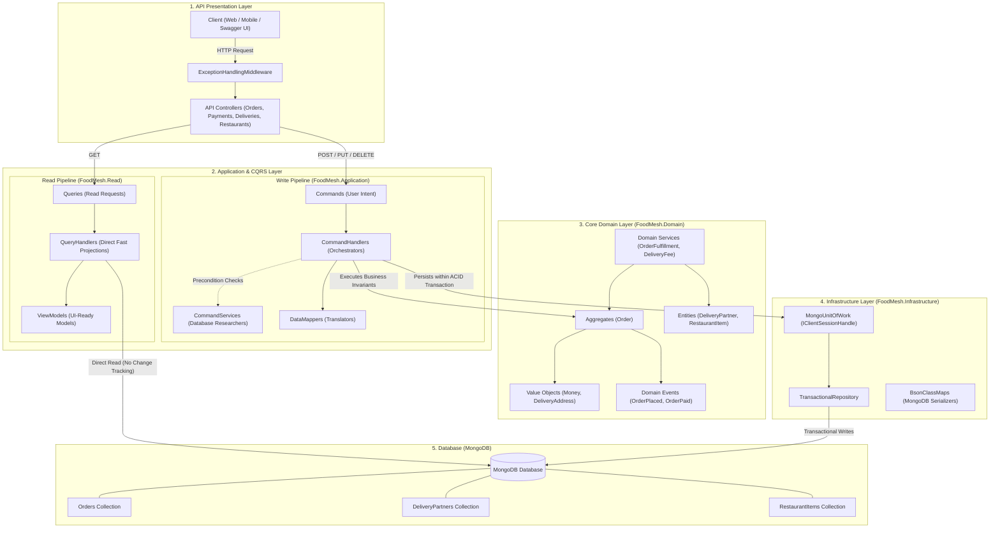
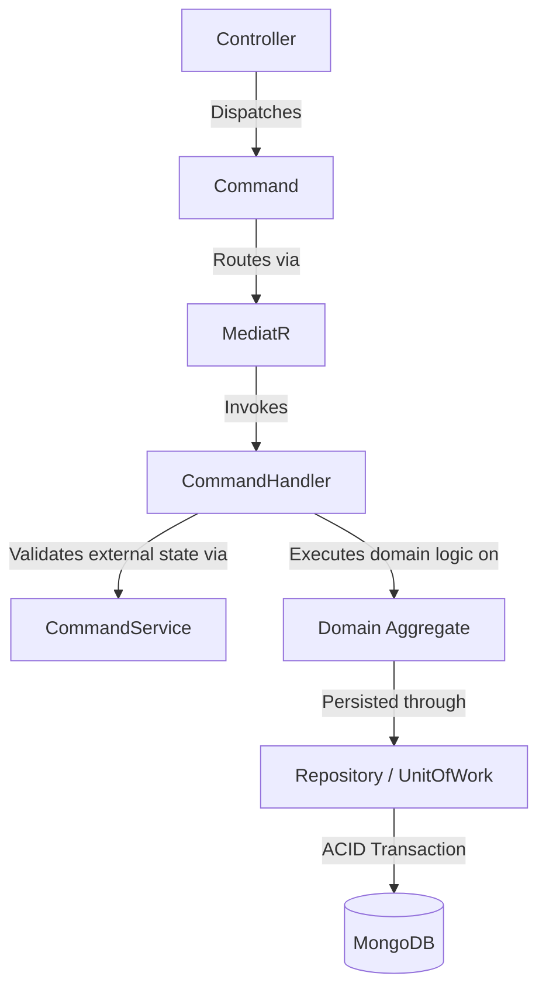
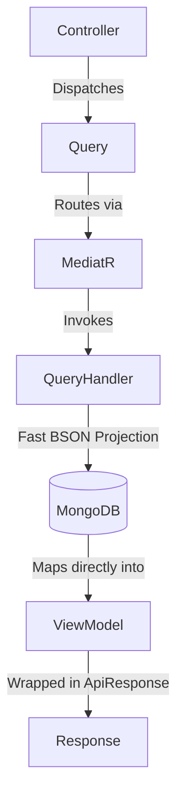

# FoodMesh — Enterprise Food Delivery Backend

A robust, enterprise-grade food delivery backend built with **.NET 8**, **Clean Architecture**, **Domain-Driven Design (DDD)**, **CQRS (Command Query Responsibility Segregation)**, and **MongoDB ACID Transactions via Unit of Work**.

---

## System Architecture Overview

FoodMesh follows **Clean Architecture** and **CQRS**, strictly separating presentation, orchestration, core domain logic, and persistence.



---

## Architecture: CQRS Request Flows

In FoodMesh, the **Write** side (state changes, business rules, multi-document transactions) and the **Read** side (fast projections directly into UI-ready ViewModels) are completely segregated.

### 1. Write Flow (Commands & State Changes)

```text
Controller
    ↓
Command
    ↓
MediatR
    ↓
CommandHandler
    ↓
CommandService (Database Researcher)
    ↓
Domain Aggregate (Business Rules & Invariants)
    ↓
Repository / UnitOfWork
    ↓
MongoDB
```

#### Mermaid Diagram


#### Step-by-Step Breakdown:
1. **Controller**: Receives HTTP request (`POST /api/orders`) and binds it to a strongly typed `Command`.
2. **Command**: Pure data contract representing user intent (e.g., `CreateOrderCommand`).
3. **MediatR**: In-process dispatcher routing the command to its designated handler.
4. **CommandHandler**: The project manager / orchestrator. It coordinates the business validation, domain execution, and persistence.
5. **CommandService**: The database researcher. Runs non-mutating database queries to check preconditions (e.g., *Is the restaurant active? Are menu items available?*).
6. **Domain Aggregate**: Enforces core domain invariants and business rules (e.g., `Order.Create()`, status transitions, line item subtotals). Emits domain events.
7. **Repository / UnitOfWork**: Encapsulates atomic data access within a single MongoDB client session transaction (`IClientSessionHandle`).
8. **MongoDB**: Persists the updated document state into collections (`Orders`, `DeliveryPartners`, etc.).

---

### 2. Read Flow (Queries & ViewModels)

```text
Controller
    ↓
Query
    ↓
MediatR
    ↓
QueryHandler
    ↓
MongoDB
    ↓
ViewModel
    ↓
Response
```

#### Mermaid Diagram


#### Step-by-Step Breakdown:
1. **Controller**: Receives HTTP request (`GET /api/orders/{id}`) and sends a `Query`.
2. **Query**: Request parameter object (e.g., `GetOrderByIdQuery`).
3. **MediatR**: Dispatches the query directly to the read query handler.
4. **QueryHandler**: Bypasses domain aggregate encapsulation and change tracking for maximum read performance.
5. **MongoDB**: Reads documents directly using lightweight BSON filters and projection.
6. **ViewModel**: Flat, UI-ready model tailored for client presentation (e.g., `OrderDetailsViewModel`, `MenuItemViewModel`).
7. **Response**: Standardized `ApiResponse<T>` wrapper returning HTTP `200 OK` or `404 Not Found`.

---

## Core Business Domain Rules

1. **Single Restaurant per Order**:
   - A customer selects dishes exclusively from **one restaurant** per order (`1 Order = 1 Restaurant`).
   - Ensures hot, fresh meals without multi-stop rider logistics.
2. **Order Lifecycle State Machine**:
   ```text
   PendingPayment ──(Pay)──> Paid ──(Prepare)──> Preparing ──(Assign Rider)──> OutForDelivery ──(Deliver)──> Delivered
         │                                 │
     (Cancel)                          (Cancel)
         ▼                                 ▼
     Cancelled                         Cancelled (Releases Rider)
   ```
3. **Rich Domain Invariants**:
   - `Money` and `DeliveryAddress` modeled as immutable **Value Objects**.
   - No primitive obsession — decimal math, currencies, and address formatting are fully self-validating.
   - Aggregate roots manage internal entity collections (`Order` encapsulates `OrderItem` list).

---

## Solution Structure

```
FoodMesh/
├── src/
│   ├── Domain/                 # Pure Business Core (Aggregates, Entities, ValueObjects, Domain Events)
│   ├── Application/            # Write Side (Commands, Handlers, CommandServices, DataMappers)
│   ├── Read/                   # Read Side (Queries, QueryHandlers, ViewModels, EventHandlers)
│   │   └── BusinessApiService/ # ASP.NET Core Web API (Controllers, Middleware, Swagger UI)
│   ├── Infrastructure/         # Persistence (MongoDB Unit of Work, Repositories, BsonClassMaps)
│   └── Shared/                 # Cross-cutting primitives (Result<T>, ApiResponse<T>, BaseEntity)
└── tests/
    └── Domain.Tests/           # Unit & Integration Tests (Domain, CQRS Handlers, API Controllers)
```

---

## REST API Endpoints

Interactive Swagger UI documentation is available at `/` when running the application.

| Area | HTTP Method & Route | Description |
|---|---|---|
| **Restaurants** | `GET /api/restaurants` | List active restaurants & available item counts |
| **Restaurants** | `GET /api/restaurants/{restaurantId}/menu` | Browse menu items for a selected restaurant |
| **Orders** | `POST /api/orders` | Place a new order with selected items and address |
| **Orders** | `GET /api/orders/{id}` | Get full order details, line items, and assigned rider |
| **Orders** | `GET /api/orders/customer/{customerId}` | Get paginated order history for a customer |
| **Orders** | `POST /api/orders/{id}/cancel` | Cancel an unfulfilled order and release assigned rider |
| **Payments** | `POST /api/payments` | Process payment for an order (`PendingPayment` ➔ `Paid`) |
| **Deliveries** | `POST /api/deliveries/assign` | Assign available rider to order (`Paid` ➔ `OutForDelivery`) |

---

## Getting Started

### Prerequisites
- [.NET 8 SDK](https://dotnet.microsoft.com/download/dotnet/8.0)
- [MongoDB Community Server](https://www.mongodb.com/try/download/community) (running locally or MongoDB Atlas)

### 1. Configure Connection
Update `src/Read/BusinessApiService/appsettings.json`:
```json
{
  "MongoDbSettings": {
    "ConnectionString": "mongodb://localhost:27017",
    "DatabaseName": "FoodMeshDb"
  }
}
```

### 2. Run the Web API
```powershell
dotnet run --project src/Read/BusinessApiService/FoodMesh.BusinessApiService.csproj
```
Open **`http://localhost:5000`** in your browser to view the interactive Swagger UI.

### 3. Run the Test Suite
```powershell
dotnet test FoodMesh.sln
```
All unit and integration tests across all layers will execute and pass.
